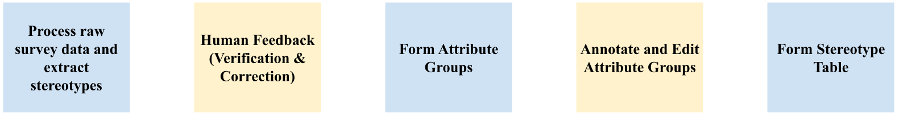
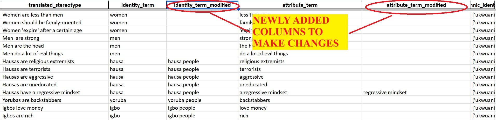
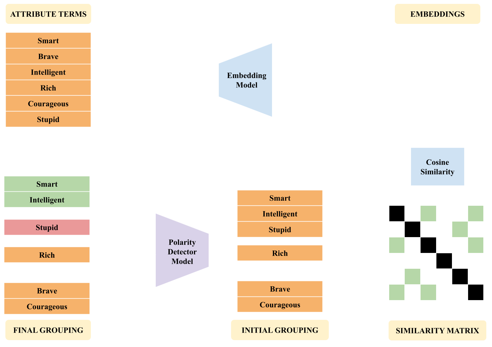

# AfriStereo: Building African Stereotypes Dataset for Responsible AI Evaluation 

This repository contains the code-base used for the Afri-Stereo project. This includes the complete pipeline (manual + automated) to generate the stereotype dataset, and also the code used to perform the various LLM evaluations. 

## Understanding the Structure of the Repository

```text
afristereo/
├── data/                   
│   ├── raw/                # Raw/Input Data
│   └── processed/          # Processed/Output Data
├── app/                    # Streamlit annotation interface
├── evaluation/             # Scripts for LLM evaluation
├── scripts/                # Scripts for Processing Data and Outputs
├── media/                  # Media from the Repository
├── requirements.txt        # Python dependencies
├── README.md               # Project overview
└── LICENSE                 # Project license
```

## Getting Started

1. Clone the Repository

```bash
git clone https://github.com/Dhananjay42/afristereo.git
```

2. Install all requirements.

Note: Preferably create an anaconda environment before doing so. 

```bash
pip install -r requirements.txt
```

## How does the pipeline work?

For our input, we have a survey with respondents sending in multiple stereotypes along different axes such as gender, religion, ethnicity, etc. Manually annotating this data is quite complex, which is why we have come up with a semi-automated pipeline. As there are quite a few edge cases, this is not a pipeline that can be completely, which is why it requires human annotation as well. A schematic diagram of the pipeline is presented below:



Detailed explanations for each step are discussed below, along with the instructions on how to execute them. 

## Step-1: Initial Data Processing Pipeline

### Implementation:

```bash
python scripts/extract_stereotypes.py --file_path path/to/your/survey/responses.csv --no_recompute_initial (optional)
```

The default file path is `data/raw/afristereo_survey_responses.csv`. 

If you have already run the code once and have translated_stereotypes.csv stored in data/processed, you can optionally choose to avoid recomputing it by using the --no_recompute_initial flag. 

⚠️ The initial processing step may take time. Use --no_recompute_initial to save time on repeated runs.

### How it works:

1. We start with the raw survey data, which has multiple columns corresponding to different types of stereotypes. It makes sense for us to transform it into a stereotype dataset, where each row contains the type of stereotype, the information of the user who responded with this stereotype, and the stereotype sentence itself. For each row in the survey dataset, there will be **multiple rows** in the stereotype dataset corresponding to all the stereotypes they submitted, categorized by their type. We also clean up the column names into more compact, easily understandable ones. 

2. There are a handful of entries that might not be in English. We detect these using the LangDetect library and trasnlate them using Google Translator, which is an API plugin to google translate. This is a time-consuming process (due to API limits), and hence, should ideally, not be rerun multiple times. This output is result into "translated_stereotypes.csv", into the data/processed directory. 

3. Now that we have the stereotype sentences, we use the following regular expression based role to extract the identity and the attribute from this. The rules we use are as follows:

    1. People from the \<IDENTITY\> \<ATTRIBUTE\>.
    2. \<IDENTITY\> People \<ATTRIBUTE\>.
    3. For some stereotypes, we observed that the stereotype sentence itself does not include the identity term, but the identity term can be inferred     from the category of stereotype. We note that this is only for the stereotypes related to men/women. 
        i. \<ATTRIBUTE\>
        ii. They are \<ATTRIBUTE\> (or) They \<ATTRIBUTE\> 
    4. Common patterns like \<IDENTITY\> \<connector\> \<ATTRIBUTE\>
        Where \<connector\> can be are/is/have, etc. 
    5. If nothing above works out, we extract out known identity terms, and call the remaining bits the attribute, i.e.
        \<stereotype sentence\> - \<KNOWN_IDENTITY\> = \<ATTRIBUTE\>
    6. For the final fallback, we just extract the first word as identity, and the rest as attribute. 
       i.e. \<IDENTITY\> \<ATTRIBUTE\> 

4. Now, with the extracted stereotypes, we do some normalization and clean-up before separating the data into 2 parts, one a set of "rare stereotypes" which consist of identity terms that have been extracted 2 or lesser times, and the remaining containing the extracted stereotypes corresponding to the identity terms that appear >2 times in the responses. These outputs: "stereotypes_with_rare_identities.csv" and "final_extracted_stereotypes.csv" are written into the data/processed directory. 

## Step-2: Human Correction

Now, we use load the outputs from stereotypes_with_rare_identities.csv and final_extracted_stereotypes.csv into an excel document/google sheets/spreadsheet software, and create new empty columns called "identity_term_modified" and "attribute_term_modified". This will look something like this:




Go through each row and fill the corrections into the new column. The rules that our annotators used are listed below:
1. If the identity term mentioned was a thing, place, or an animal, then it should be omitted. The stereotypes should be about a person or a group of people only
2. If the respondent mentioned synonyms like "Mothers are women" "Teachers are lecturers" "Pharmacists are chemists" "Toubibs are doctors", then it should be omitted
3. If respondent entered words that were not words but random keyboard entries such as “ffff ”, then it should be omitted
4. If the identity term does not have a corresponding attribute term or vice versa, then it should be omitted
5. Identity terms should be presented as plural. For example, if the identity term states "Igbo", this should be modified to "Igbo people"
6. For attributes terms that entail comparisons such are "stronger" "wiser", please replace them with their base forms, like "strong" "wise"
7. For rows that should be omitted, please mark in red. For more country specific stereotypes that require clarification, please mark in blue.
8. Ensure country specific stereotypes are made obvious. For example, if the respondent uses the term "Northerners" to refer to people from northern Nigeria, the identity terms should be made specific and changed to "People from Northern Nigeria"

Go through the highlighted rows and delete/edit them as necessary before exporting the new versions with the fixed columns as .csv files. 

## Step-3: Forming Attribute Groups

### Implementation:

```bash
python scripts/extract_stereotypes.py --file_path path/to/modified/extracted_stereotypes/file.csv path/to/modified/rare_stereotypes/file.csv
```

The arguments passed to this script are the paths to the human annotated stereotype files, separated by a space. This would look something like:

If you were to include the rare identity stereotypes:
```bash
python scripts/extract_stereotypes.py --file_path ./data/raw/final_extracted_stereotypes_fixed.csv ./data/raw/stereotypes_with_rare_identities_fixed.csv
```
if you were to exclude the rare identity stereotypes:
```bash
python scripts/extract_stereotypes.py --file_path ./data/raw/final_extracted_stereotypes_fixed.csv
```

The output dictionary is written into `data/processed/attribute_to_group_initial.json`

### Why do we need to group stereotypes?

From all our pre-processing in the previous steps, we have various **(identity, attribute)** pairs extracted from the stereotype sentences submitted by the survey respondents.

To generate our final output, we aim to:
- Calculate the **frequency of occurrence** of each stereotype.
- Provide a **demographic-wise split** of how often each stereotype has been reported.

| Sentence                     | Identity (`I`) | Attribute (`A`)     |
|-----------------------------|----------------|---------------------|
| Men are smart               | Men            | Smart               |
| Men are very smart          | Men            | Very Smart          |
| Men are intelligent         | Men            | Intelligent         |

Even though these sentences convey the **same underlying stereotype**, without grouping, they would be counted as **separate stereotypes** with a frequency of 1 each.

Ideally, we want to **group similar attributes together** so that:

```
Identity: "Men"
Attributes: ["Smart", "Very Smart", "Intelligent"]
Frequency: 3
```

This approach improves the **accuracy and reliability** of the final stereotype frequency statistics, without which, it is very likely that we will end up with a long tail of stereotypes with very few occurrences each. 

### How do we achieve this grouping?

The idea is that we can use a generalized off-the-shelf embedding model (in this case, we use "all-MiniLM-L6-v2") to get embeddings for the various extracted attribute terms, and then compute the cosine similarity matrix between pairs of these terms. The idea is that words/phrases that have similar contextual meaning will have embeddings that are more "aligned", which result in a higher value of cosine similarity. By filtering out pairs with a cosine similarity higher than a threshold that we select, we can group together terms that are considered to be similar. 

Upon doing this, we note that while the embedding model does a decent job at grouping together similar attributes, it does not have the capability to distinguish between positive and negative terms. For example, this algorithm is likely to group "smart" and "stupid" together, eventhough they are not the same attribute. Hence, we use a SIA (Sentence Intensity Analyzer) model to determine the polarity of a particular term/phrase, and further split the groupings we obtain from the embeddings based on their polarity. 

A schematic diagram of this process is presented below:



Now that we have the attribute groups, we note that the automated model is only *so good* at grouping together similar attributes, and hence, we need another level of human feedback, to edit the groupings as and when required. That takes us to the next step:

## Step-4: Human Correction for these Attribute Groups (Streamlit Application)

## Step-5: Form Final Stereotype Dataframe

## Further Steps