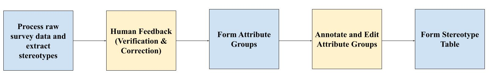

# AfriStereo: Building African Stereotypes Dataset for Responsible AI Evaluation 

This repository contains the code-base used for the Afri-Stereo project. This includes the complete pipeline (manual + automated) to generate the stereotype dataset, and also the code used to perform the various LLM evaluations. 

## Understanding the Structure of the Repository

```text
afristereo/
├── data/                   
│   ├── raw/                # Raw/Input Data
│   └── processed/          # Processed/Output Data
├── app/                    # Streamlit annotation interface
├── evaluation/             # Scripts for LLM evaluation
├── scripts/                # Scripts for Processing Data and Outputs
├── media/                  # Media from the Repository
├── requirements.txt        # Python dependencies
├── README.md               # Project overview
└── LICENSE                 # Project license
```

## Getting Started

1. Clone the Repository

```bash
git clone https://github.com/yourname/yourrepo.git
```

2. Install all requirements.

Note: Preferably create an anaconda environment before doing so. 

```bash
pip install -r requirements.txt
```

## How does the pipeline work?

For our input, we have a survey with respondents sending in multiple stereotypes along different axes such as gender, religion, ethnicity, etc. Manually annotating this data is quite complex, which is why we have come up with a semi-automated pipeline. As there are quite a few edge cases, this is not a pipeline that can be completely, which is why it requires human annotation as well. A schematic diagram of the pipeline is presented below:



Detailed explanations for each step are discussed below, along with the instructions on how to execute them. 

## Step-1: Initial Data Processing Pipeline

## Step-2: Human Correction

## Step-3: Forming Attribute Groups

## Step-4: Human Correction for these Attribute Groups (Streamlit Application)

## Step-5: Form Final Stereotype Dataframe

## Further Steps